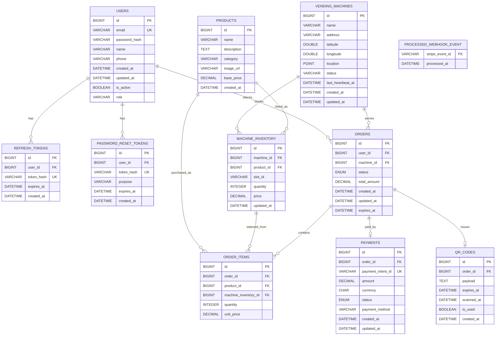

# Database Schema Design

Source of truth: `/home/runner/work/neovarsity-project/neovarsity-project/db-migration.sql`

## Tables

### users
- `id` BIGINT UNSIGNED PK AUTO_INCREMENT
- `email` VARCHAR(255) UNIQUE NOT NULL
- `password_hash` VARCHAR(255) NOT NULL
- `name` VARCHAR(100) NOT NULL
- `phone` VARCHAR(20)
- `created_at` DATETIME(6) NOT NULL
- `updated_at` DATETIME(6) NOT NULL
- `is_active` TINYINT(1) NOT NULL
- `role` VARCHAR(20)

### refresh_tokens
- `id` BIGINT UNSIGNED PK AUTO_INCREMENT
- `user_id` BIGINT UNSIGNED FK -> `users.id` NOT NULL
- `token_hash` VARCHAR(255) UNIQUE NOT NULL
- `expires_at` DATETIME NOT NULL
- `created_at` DATETIME NOT NULL

### password_reset_tokens
- `id` BIGINT UNSIGNED PK AUTO_INCREMENT
- `user_id` BIGINT UNSIGNED FK -> `users.id` NOT NULL
- `token_hash` VARCHAR(255) UNIQUE NOT NULL
- `purpose` VARCHAR(255) NOT NULL
- `expires_at` DATETIME(6) NOT NULL
- `created_at` DATETIME(6) NOT NULL

### vending_machines
- `id` BIGINT UNSIGNED PK AUTO_INCREMENT
- `name` VARCHAR(100) NOT NULL
- `address` VARCHAR(255) NOT NULL
- `latitude` DOUBLE NOT NULL
- `longitude` DOUBLE NOT NULL
- `location` POINT SRID 4326 NOT NULL
- `status` VARCHAR(15) NOT NULL
- `last_heartbeat_at` DATETIME(6)
- `created_at` DATETIME(6) NOT NULL
- `updated_at` DATETIME(6) NOT NULL

### products
- `id` BIGINT UNSIGNED PK AUTO_INCREMENT
- `name` VARCHAR(100) NOT NULL
- `description` TEXT
- `category` VARCHAR(50) NOT NULL
- `image_url` VARCHAR(512)
- `base_price` DECIMAL(10,2) NOT NULL
- `created_at` DATETIME(6) NOT NULL

### machine_inventory
- `id` BIGINT UNSIGNED PK AUTO_INCREMENT
- `machine_id` BIGINT UNSIGNED FK -> `vending_machines.id` NOT NULL
- `product_id` BIGINT UNSIGNED FK -> `products.id` NOT NULL
- `slot_id` VARCHAR(10) NOT NULL
- `quantity` INTEGER NOT NULL
- `price` DECIMAL(10,2) NOT NULL
- `updated_at` DATETIME(6) NOT NULL

### orders
- `id` BIGINT UNSIGNED PK AUTO_INCREMENT
- `user_id` BIGINT UNSIGNED FK -> `users.id`
- `machine_id` BIGINT UNSIGNED FK -> `vending_machines.id` NOT NULL
- `status` ENUM(...) NOT NULL
- `total_amount` DECIMAL(10,2) NOT NULL
- `created_at` DATETIME(6) NOT NULL
- `updated_at` DATETIME(6) NOT NULL
- `expires_at` DATETIME(6) NOT NULL

### order_items
- `id` BIGINT UNSIGNED PK AUTO_INCREMENT
- `order_id` BIGINT UNSIGNED FK -> `orders.id` NOT NULL
- `product_id` BIGINT UNSIGNED FK -> `products.id` NOT NULL
- `machine_inventory_id` BIGINT UNSIGNED FK -> `machine_inventory.id` NOT NULL
- `quantity` INTEGER NOT NULL
- `unit_price` DECIMAL(10,2) NOT NULL

### payments
- `id` BIGINT UNSIGNED PK AUTO_INCREMENT
- `order_id` BIGINT UNSIGNED FK -> `orders.id` UNIQUE NOT NULL
- `payment_intent_id` VARCHAR(255) UNIQUE NOT NULL
- `amount` DECIMAL(10,2) NOT NULL
- `currency` CHAR(3) NOT NULL
- `status` ENUM(...) NOT NULL
- `payment_method` VARCHAR(50)
- `created_at` DATETIME(6) NOT NULL
- `updated_at` DATETIME(6) NOT NULL

### processed_webhook_event
- `stripe_event_id` VARCHAR(255) PK
- `processed_at` DATETIME(6) NOT NULL

### qr_codes
- `id` BIGINT UNSIGNED PK AUTO_INCREMENT
- `order_id` BIGINT UNSIGNED FK -> `orders.id` UNIQUE NOT NULL
- `payload` TEXT NOT NULL
- `expires_at` DATETIME(6) NOT NULL
- `scanned_at` DATETIME(6)
- `is_used` TINYINT(1) NOT NULL
- `created_at` DATETIME(6) NOT NULL

## Mermaid ER Diagram

